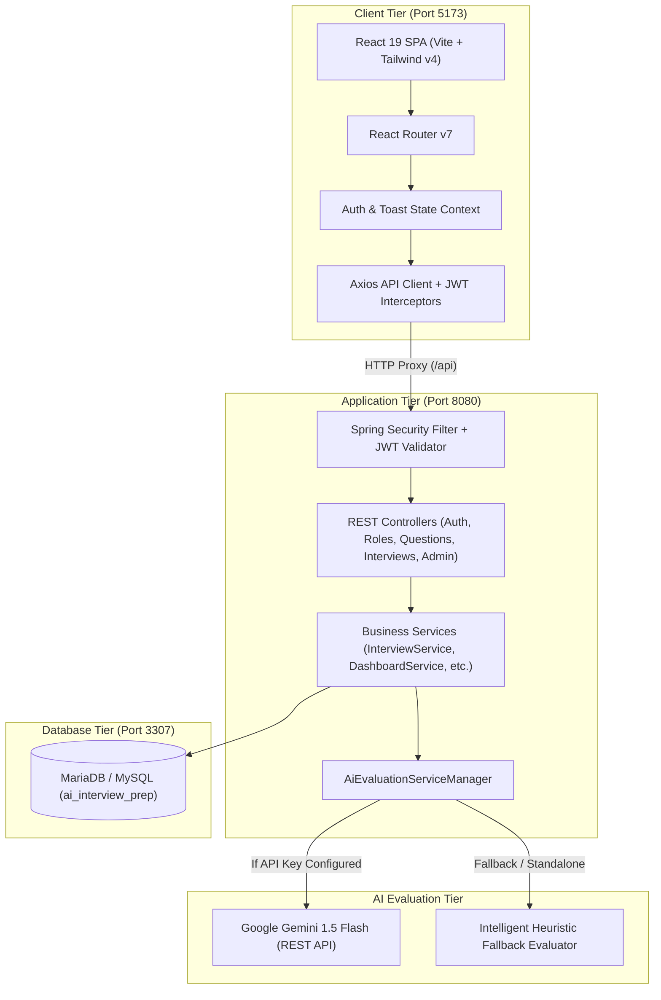

# 🎯 AI Interview Prep

> **An AI-powered interview preparation platform for college students and job seekers.**  
> Built as a production-grade, full-stack web application based on the B.Tech project synopsis by **Team "Coffee and Code"** (*Shubhamji Gupta, Pawan Kumar, Ashish Kumar Sharma* at Maharishi Markandeshwar Deemed to be University).

---

## 🚀 Live Local URLs

| Service | URL | Description |
|---|---|---|
| **Frontend Application** | [`http://localhost:5173`](http://localhost:5173) | Modern React 19 + Tailwind v4 Single Page App |
| **Backend API** | [`http://localhost:8080/api`](http://localhost:8080/api) | Spring Boot 3.3.5 REST API with JWT Auth |
| **Database** | `127.0.0.1:3307` | Dedicated MariaDB / MySQL (`ai_interview_prep`) |

---

## 🔑 Demo Credentials

| Role | Email | Password | Pre-loaded Data |
|---|---|---|---|
| **Student** | `student@aiinterview.com` | `student123` | Completed interviews, scores, history, progress |
| **Admin** | `admin@aiinterview.com` | `admin123` | Full access to Question Bank & Role Management |

> 💡 *The login page includes 1-click demo credential autofill buttons for both Student and Admin accounts!*

---

## 🛠️ Tech Stack

### Frontend
- **Framework**: React 19 with TypeScript
- **Bundler & Tooling**: Vite 6, `@tailwindcss/vite`
- **Styling**: Tailwind CSS v4 with modern slate / indigo theme
- **Routing**: React Router v7 (`react-router-dom`)
- **HTTP Client**: Axios with Bearer JWT interceptors and auto-refresh/redirect
- **Icons & Visuals**: `lucide-react`, `canvas-confetti`

### Backend
- **Framework**: Java 21, Spring Boot 3.3.5
- **Security**: Spring Security 6 with stateless JWT authentication (`io.jsonwebtoken:jjwt:0.12.6`) and BCrypt password hashing
- **Persistence**: Spring Data JPA with Hibernate ORM
- **Database**: MariaDB / MySQL running on dedicated port 3307
- **Validation**: Jakarta Bean Validation (`spring-boot-starter-validation`)
- **Build System**: Apache Maven 3.9.9

### AI Engine (Modular Architecture)
- **Primary AI Provider**: Google Gemini API (`GeminiAiEvaluationService`) using Gemini 1.5 Flash
- **Intelligent Heuristic Fallback**: `MockAiEvaluationService` automatically activates when `GEMINI_API_KEY` is not set or network fails. Performs contextual keyword analysis, semantic coverage check, completeness grading, and delivers structured scores (1-10) with targeted strengths and weaknesses.
- **Service Delegator**: `AiEvaluationServiceManager` routes requests cleanly without frontend exposure.

---

## 📊 System Architecture



---

## ✨ Key Features & User Journeys

### 1. 🎓 Student Experience
- **Interactive Practice Arena**:
  - Select target job role (Java Developer, Frontend Developer, Backend Developer, Full Stack, Python Developer, Data Analyst, Software Engineer, HR/Behavioral).
  - Select difficulty level (Beginner, Intermediate, Advanced) and question count.
  - Live session with countdown timer, auto-expanding code/text editor, question switcher, and instant answer submission.
- **Immediate AI Feedback**:
  - Detailed score out of 10.
  - Multi-dimensional breakdown: Correctness, Relevance, Completeness, Clarity.
  - Specific, actionable strengths and areas for improvement.
- **Comprehensive Performance Report**:
  - Overall readiness score and graduation badge.
  - Skill breakdown radar / bar visualizations.
  - Question-by-question comparative review (Candidate Answer vs Model Answer with AI comments).
- **Dashboard & Analytics**:
  - Key metrics: Total interviews, completed sessions, average score, personal best.
  - Recent interview sessions with quick resume/review actions.
  - Progress tracking over time.

### 2. 🛡️ Admin Experience
- **Analytics Overview**: Platform-wide metrics including total users, sessions conducted, active questions, and global average score.
- **Question Bank Management**:
  - Filter questions by role and difficulty.
  - Add new interview questions with expected topics and model answers.
  - Edit or toggle active/inactive status.
- **Role Management**:
  - Create, update, or remove interview tracks/roles.
  - Configure icons, descriptions, and baseline difficulties.
- **Session Audit**: Inspect any candidate's past interview session, review answers, and check AI feedback.

---

## ⚡ Quick Start Scripts

The project includes batch scripts in the root directory for easy single-click operation:

### Launch All Services
Double click or run:
```cmd
start-all.bat
```
*This starts MariaDB (port 3307), Spring Boot (port 8080), and Vite Dev Server (port 5173).*

### Stop All Services
Double click or run:
```cmd
stop-all.bat
```
*This cleanly stops any processes running on ports 5173, 8080, and 3307.*

---

## 🔧 Manual Setup & Running

### 1. Database
```cmd
"C:\Program Files\MariaDB 12.2\bin\mysqld.exe" --datadir="C:\Users\ashis\scratch\ai-interview\mariadb-data" --port=3307 --bind-address=127.0.0.1
```

### 2. Backend (Spring Boot)
```cmd
cd backend
"C:\Program Files\JetBrains\IntelliJ IDEA 2025.2\plugins\maven\lib\maven3\bin\mvn.cmd" spring-boot:run
```

### 3. Frontend (React + Vite)
```cmd
cd frontend
npm.cmd run dev -- --host 127.0.0.1 --port 5173
```

---

## 🤖 Configuring Google Gemini AI (Optional)

To enable live Gemini AI evaluations instead of the mock engine:
1. Obtain an API key from [Google AI Studio](https://aistudio.google.com/).
2. In `backend/src/main/resources/application.properties` (or as an environment variable):
   ```properties
   ai.gemini.api-key=YOUR_ACTUAL_GEMINI_API_KEY
   ai.gemini.model=gemini-1.5-flash
   ```
3. Restart the backend. The platform will automatically route evaluations through Gemini! If the key is omitted or invalid, it gracefully falls back to the smart mock evaluator.
